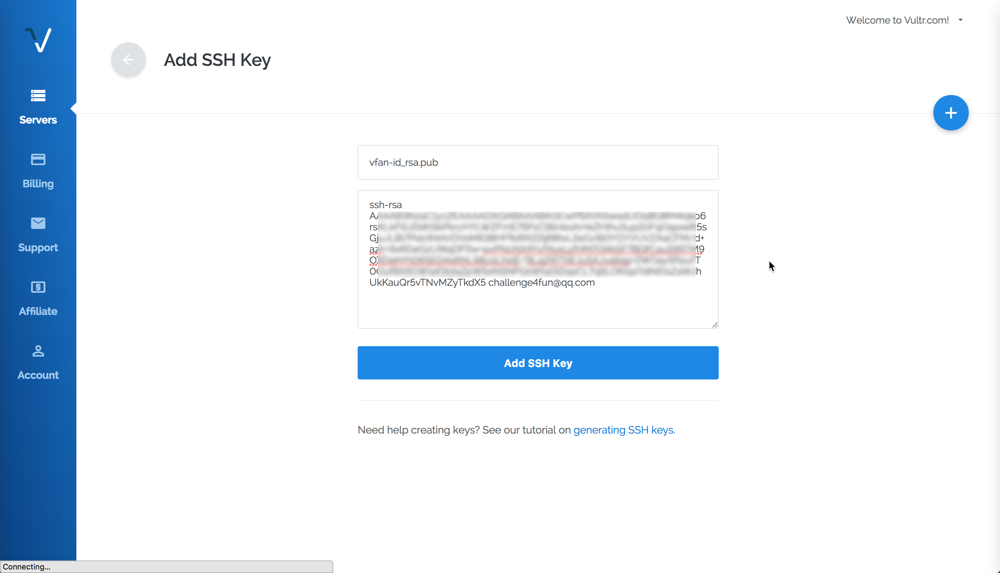
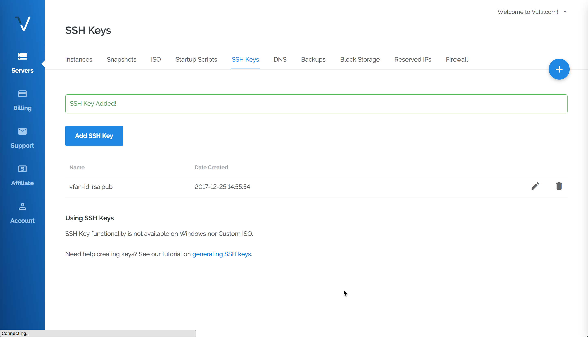

[TOC]

---

[How to Use SSH with Vultr Servers](https://www.vultr.com/docs/how-to-use-ssh-with-vultr-servers/)

> SSH is pre-installed on macOS and Linux. Windows users may need to install `OpenSSH`.

## change passwd

在 vultr 创建的 server instance，默认的 Username 为 root，默认的 Password 比较难记。

通过 SSH 登录后，可输入 `sudo passwd root` 回车，系统会提示输入两遍 root 密码，输入想设的新密码即可。

另外，我们也可给 vultr 添加 SSH Key，并添加应用到 server instance 中，这样就可以实现 ssh 命令免密登录。

## SSH Key Pair

What is an SSH Key Pair?

SSH key pair contains a *public* key and a *private* key. The public key is stored on the **server**, and the private key is stored on the **local** machine that will be used for connecting to the remote server. Both keys are necessary to SSH into a server using the SSH keys.

## Generate Keys

How to Generate Keys on Windows, Linux, Mac?

[How Do I Generate SSH Keys?](https://www.vultr.com/docs/how-do-i-generate-ssh-keys)

Generate Keys use the `ssh-keygen` Command:

```Shell
ssh-keygen -t ed25519 -C email@example.com
```

## Add SSH keys

[How to Add and Delete SSH Keys](https://www.vultr.com/docs/how-to-add-and-delete-ssh-keys)

通过 `左侧边栏 - Account - SSH Keys` 或 `右侧头像 - SSH Keys`，打开 vultr 的 SSH 公钥管理界面。

点击【Add SSH Key】按钮，填写 Name ，并复制公钥文件（~/.ssh/id_ed25519.pub）中的内容。填好后，点击【Add SSH Key】按钮确认添加。





```Shell
faner@MBPFAN-MB0:~|⇒  ssh -i ~/.ssh/id_rsa root@ip.ip.ip.ip
```

> -i identity_file

```Shell
faner@MBPFAN-MB0:~|⇒  ssh root@ip.ip.ip.ip
The authenticity of host 'ip.ip.ip.ip (ip.ip.ip.ip)' can't be established.
ECDSA key fingerprint is SHA256:*******************************************.
Are you sure you want to continue connecting (yes/no)? 
```

默认会提示一个 SSH 密钥，输入 `yes` 同意，提示输入 root 账户密码：

```Shell
Warning: Permanently added 'ip.ip.ip.ip' (ECDSA) to the list of known hosts.
root@ip.ip.ip.ip's password: 
```

输入正确的 root 账户密码后，成功登录进 VPS 服务器（hostname 为 vfan）：

```Shell
-bash: warning: setlocale: LC_CTYPE: cannot change locale (UTF-8): No such file or directory
[root@vfan ~]# 
```

## apply SSH Key

[Deploy a New Server with an SSH Key](https://www.vultr.com/docs/deploy-a-new-server-with-an-ssh-key)

Changing SSH keys on a **running** server using the Customer Portal will *reinstall* and *wipe* all data on the server. You can manually change SSH keys *without* reinstalling the server by following this Quickstart Guide.

[How to Add a Key to an Existing Server](https://www.vultr.com/docs/how-to-use-ssh-with-vultr-servers/)

The SCP command is used to copy a file to the remote server. Your public SSH key must be copied to the server to enable SSH authentication. You can use the `scp` command to copy the public key to the remote server.

Launch the command prompt or the Linux Shell and execute the below command to copy the public key.

```Shell
$ scp ~/.ssh/id_ed25519.pub root@192.0.2.123:/home/example_user
```

除了上面说的，将公钥通过 scp 远程拷贝到已经创建的 server instance，还可以先 destroy 销毁正在运行的实例，再创建 deploy 新的实例。

> 需要注意的是，销毁重建可能会重新分配 IP 地址！

移除重建实例之后，需要本地清除 `~/.ssh/known_hosts` 中移除 Vultr 服务器 `ip.ip.ip.ip` 对应的配置，然后重新输入 ssh 命令重连。

```Shell
faner@MBPFAN-MB0:~|⇒  ssh root@ip.ip.ip.ip
@@@@@@@@@@@@@@@@@@@@@@@@@@@@@@@@@@@@@@@@@@@@@@@@@@@@@@@@@@@
@    WARNING: REMOTE HOST IDENTIFICATION HAS CHANGED!     @
@@@@@@@@@@@@@@@@@@@@@@@@@@@@@@@@@@@@@@@@@@@@@@@@@@@@@@@@@@@
IT IS POSSIBLE THAT SOMEONE IS DOING SOMETHING NASTY!
Someone could be eavesdropping on you right now (man-in-the-middle attack)!
It is also possible that a host key has just been changed.
The fingerprint for the ECDSA key sent by the remote host is
SHA256:*******************************************.
Please contact your system administrator.
Add correct host key in /Users/faner/.ssh/known_hosts to get rid of this message.
Offending ECDSA key in /Users/faner/.ssh/known_hosts:16
ECDSA host key for ip.ip.ip.ip has changed and you have requested strict checking.
Host key verification failed.
faner@MBPFAN-MB0:~|⇒  
```

## SSH会话过期问题

```Shell
ssh -i ~/.ssh/id_rsa -o ServerAliveInterval=60 root@ip.ip.ip.ip
```

[解决ssh连接一段时间后光标无响应问题](http://blog.csdn.net/u010521546/article/details/45623469)  
