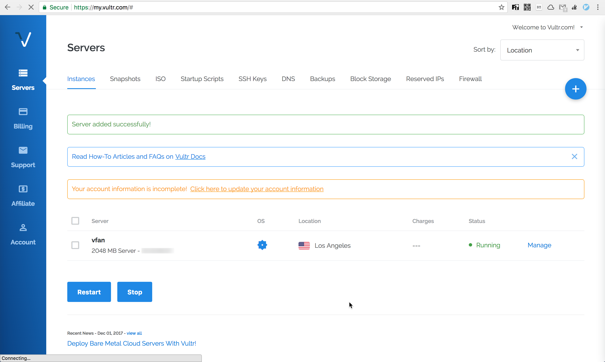

[TOC]

[Vultr和Hostwinds对比哪家好？](https://zhuanlan.zhihu.com/p/470011907)

# Vultr Cloud Compute(VC2)

## Server Location

Los Angeles

## Server Type

64 bit OS

CentOS 7 x64

## Server Size

$10 / mon

40GB SSD  
1 CPU  
2048MB Memory  
2000GB Bandwidth  

## Aditional Features

- [x] Enable IPV6  
- [ ] Enable Auto Backups - $2 / mon  
- [ ] Enable DDOS Protection - $10 / mon  
- [ ] Enable Private Networking (Add a internal IP to this VM)  

## Startup Script

Add New：以后再添加

## SSH Keys

Add New：以后再添加

## Server Hostname & Label

server hostname: zimushan  
server label: zimushan(auto same as hostname)  

点击 Deploy Now 按钮，进入 Servers 页面，Server added successfully!  

# Servers

## Installing

Status 为 Installing：

安装成功转换为绿色的 Running：

> Your account information is incomplete!  Click here to update your account information

## Servers Instances

 Vultr 管理页面的各项功能：
 
@img 

## Server Information

点击 Manage 可进入查看 Server Information

@img 

- Location: 服务器所在机房地址；  
- IP Address: IP 地址；  
- Username: 管理员账户（root）  
- Password: 默认密码  

可通过 SSH 远程登录到服务器：`ssh root@ip`  

菜单中的 Settings 可以修改机器名（Change Hostname），不过需要 reinstall。

右上角操作图标：

- View Console：通过 Web 在线登录服务器。  
- Server Stop: 停止服务器。  
- Server Restart：重启服务器。  
- Server Reinstall：重装服务器。  
- Server Destroy：销毁服务器。  

如果我们想切换操作系统，或者使用项目一段时间不想用，建议 Destroy 删除当前 VPS，这样就不会计费，账户余额可以下次继续使用。

# 2023.02.22

## Choose Server

`Cloud Compute` (Shared vCPU), Starting from $2.50/mo

> Vultr Cloud Compute（VC2）就是普通的VPS。

## CPU & Storage Technology

`AMD High Performance` —— Default

> 如果选择 Intel Regular Performance，并且 Disable Auto Backups，低至 $5/month。

## Server Location

`Los Angeles`

如果选 Tokyo，IP 好像被封了！？

## Server Image

`CentOS` 7x64

> 默认是 Debian，也可选择 Ubuntu。

## Server Size

- 25 GB NVMe
- $6/month
- $0.009/hour

- 1 vCPU
- 1 GB Memory
- 2 TB Bandwidth

[VULTR 设置流量限制，避免高额流量费](https://www.vultrvps.com/vultr-bandwidth-limit.html)

## Add Auto Backups

$1.20/mo

Disable Auto Backups

## Additional Features

Enable IPv6: 不计入收费。

## Summary

$6.00/month ($0.009/hour)
