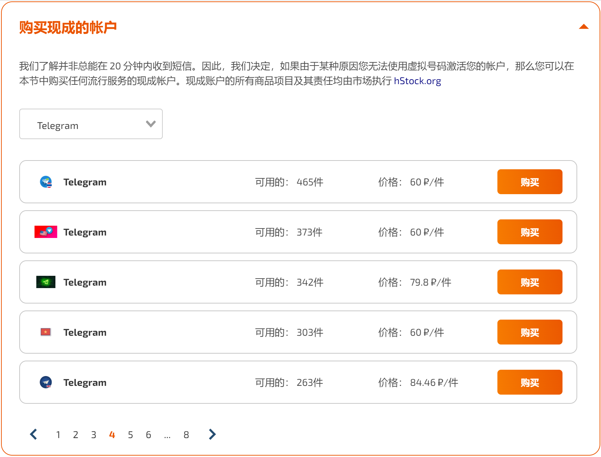

[TOC]

[如何获得一个属于自己的Telegram（TG/电报/飞机）账号？](https://www.henduohao.com/a/how-to-get-a-telegram-account)  
[Telegram：新手指南、使用教程及频道推荐（持续更新中）](https://blog.laoda.de/archives/telegram/index.html)  

## sms activate查找代售Telegram帐户

[sms activate](https://sms-activate.org/en) 主营提供国外临时短信验证，也出售一些已注册帐号，支持支付宝充值（最低充值1美元）。

- 1 US Dollar = 7.16 Chinese Yuan
- 1 Chinese Yuan = 12.94 Russian Ruble

从 [Ready Made Accounts](https://sms-activate.org/en/freePrice#buy-ready-made-account) 购买现成的账户，下拉选择 `Telegram`：

- 图标一般为帐户注册地国旗缩略图。

翻页查找带 `Tdata` 字样的账号，以下给出两个账号符合要求的样例：

1. BUY A READY-MADE ACCOUNT TELEGRAM：`Tdata Format`，约合7.7元。

2. 解开机器人Telegram：`Tdata`，约合6.5元。

## sms activate购买tdata数据格式帐号

点击购买上面样例2 —— Tdata格式的 Telegram UK +44 帐号，购买成功的弹窗上有个 yandex disk 链接，打开链接从 yandex disk 下载一个zip，解压出来是一个 tdata 文件夹。

- tdata存储连接：https://disk.yandex.ru/d/qxxxxxxxxxxxxg

## 下载安装桌面客户端

https://telegram.org/apps - Desktop apps

- [Telegram for Windows/Mac/Linux](https://desktop.telegram.org/)

PC便捷版：Telegram for Windows x64（Portable version）

