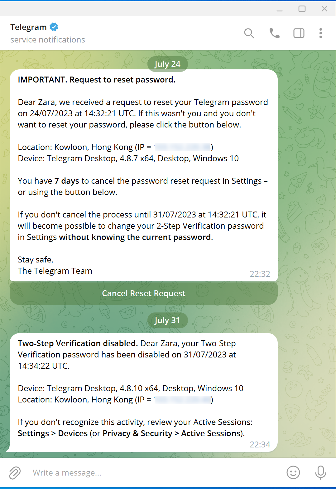
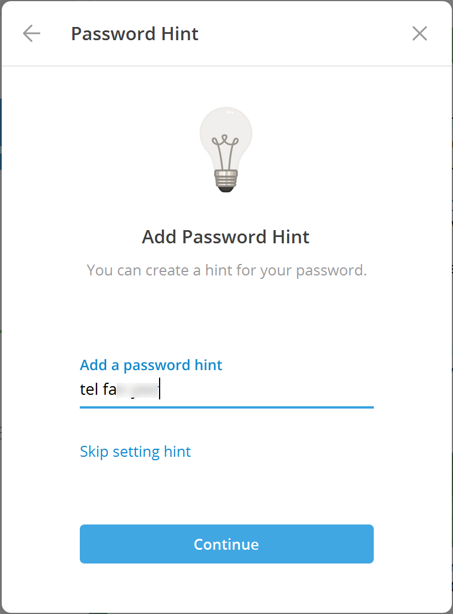
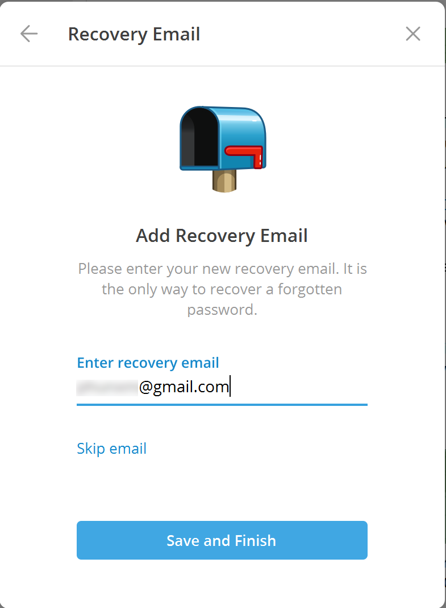
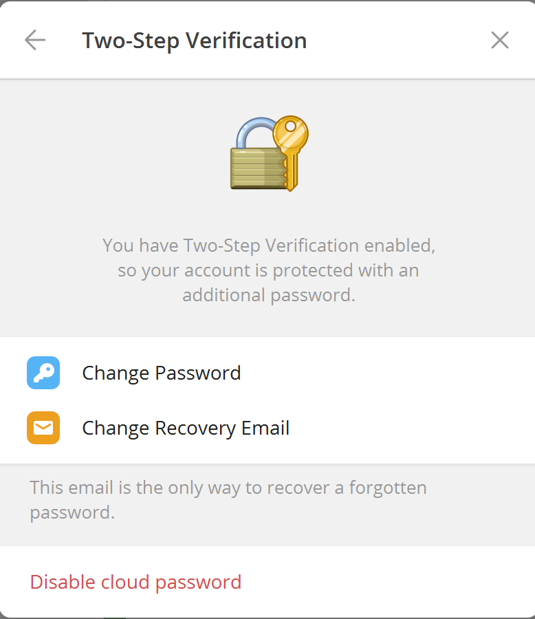
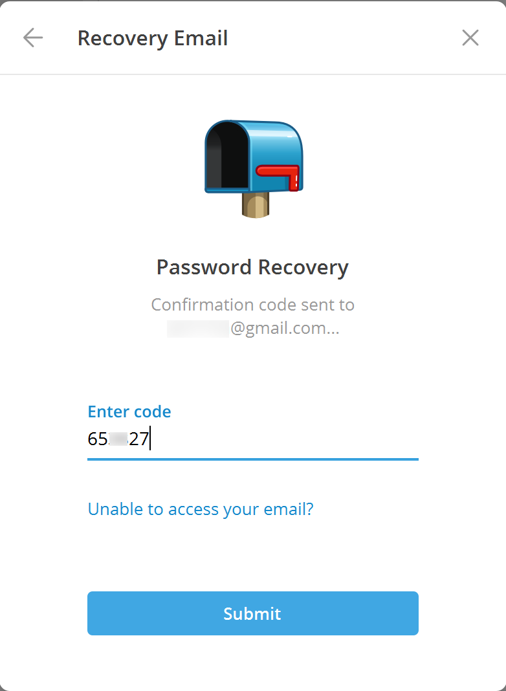

[TOC]

买来的 Telegram 账号，已经开启了双重验证（Two-Step Verification），默认是基于手机短信验证，没有设置找回邮箱。

## 请求重设

[How To Reset Telegram Password Without Email?](https://geekwiser.com/how-to-reset-telegram-password-without-email/)

等7天后，再点击 reset password，将关闭双重验证（Two-Step Verification Disabled）。

- 此时，如果误点 Cancel Reset Request，则又得等7天后才能重新 Reset。

## 重设配置

重新设置新密码后，添加密码提示（Add password Hint）：

添加密码找回邮箱（Add Recovery Email）：

保存后，将向邮箱发送一个验证码，输入验证码后将开启双重验证（提示 Two-Step Verification Enabled）：

## 忘记重设

如果忘记了密码，点击 Forget Password，可以通过邮箱校验码重设密码：

