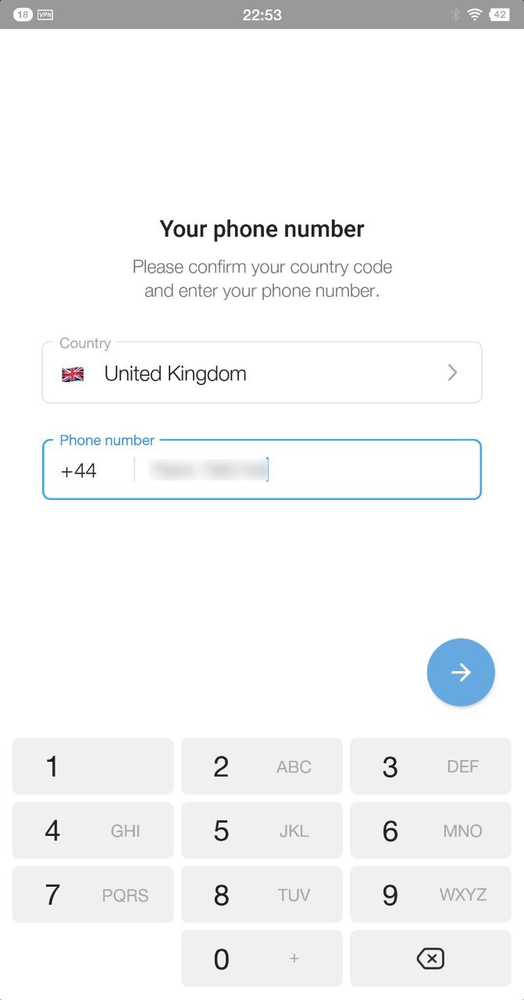
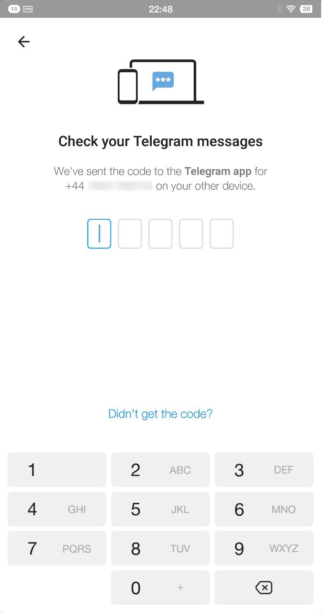
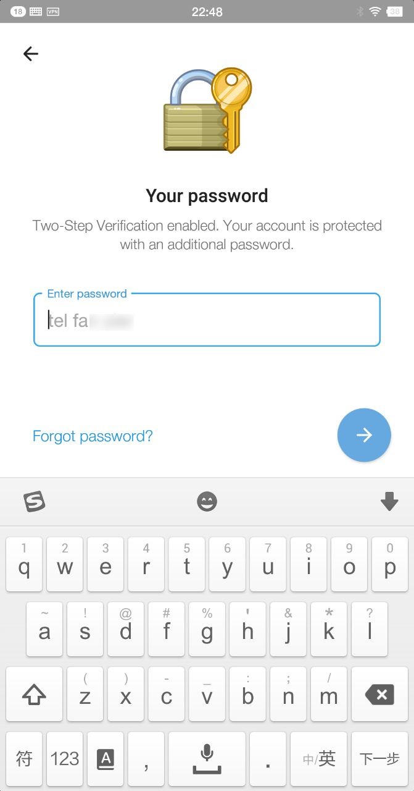
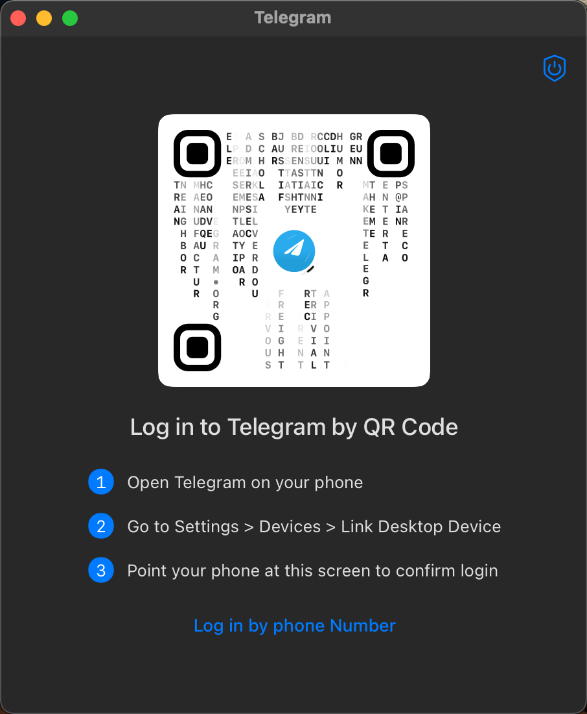
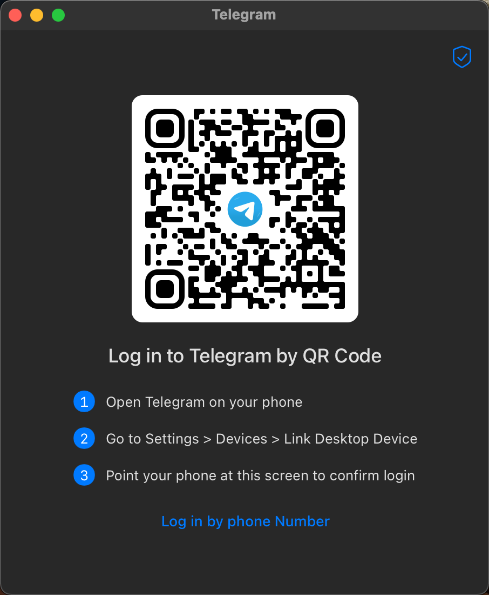
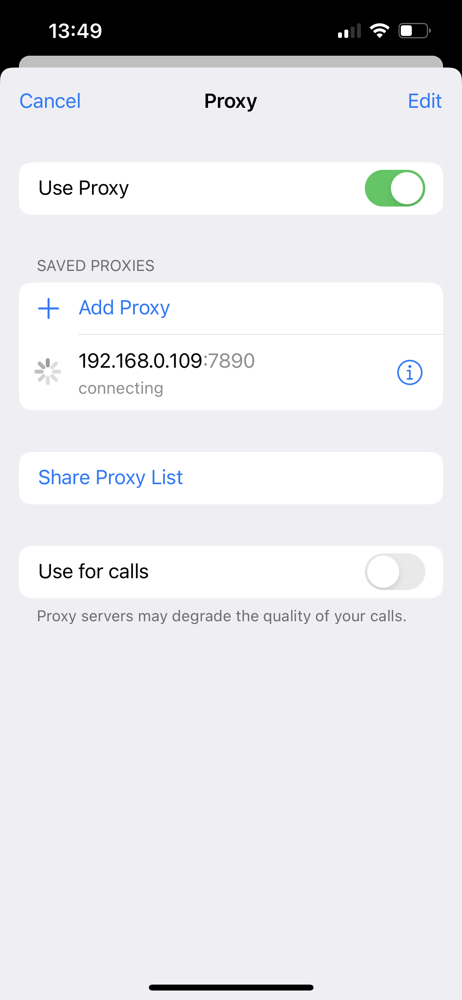
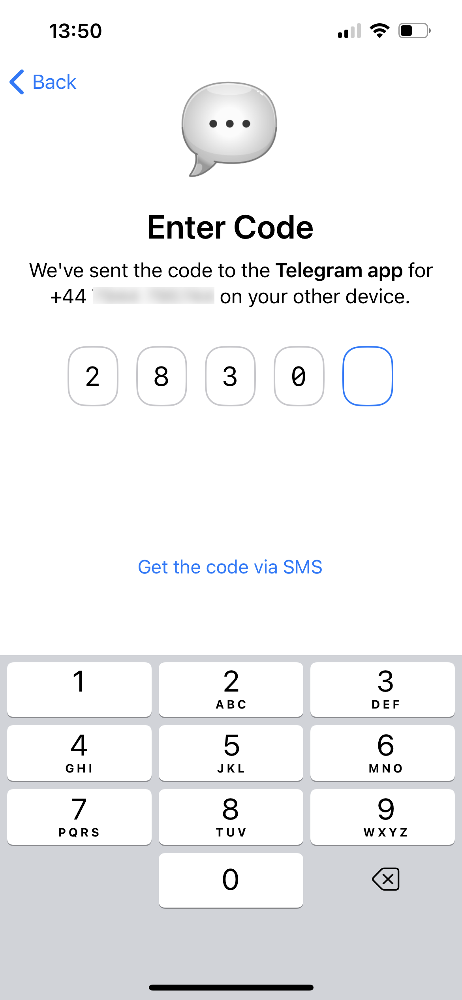
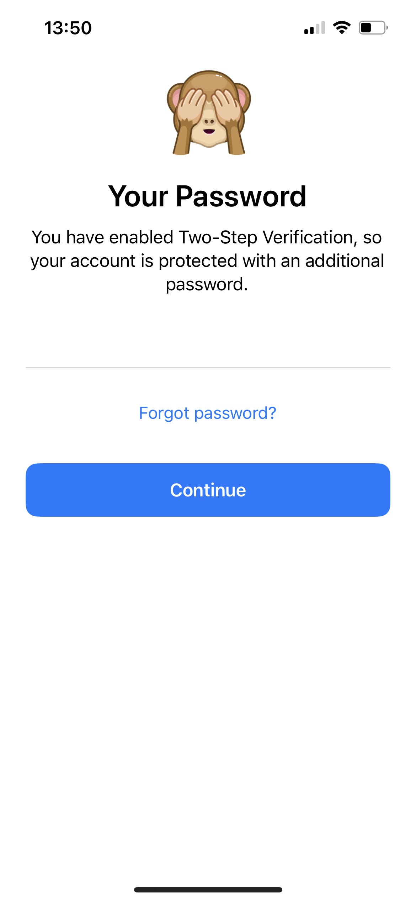

[TOC]

买来的 tdata 数据格式的 Telegram 账号，只能在 PC 端替换登录。

Forget & Reset Password 重新设置密码（和提示）并指定找回密码邮箱后，可以支持多端同步登录。

## Telegram Apps

https://telegram.org/apps - Desktop apps

- [Telegram for Windows/Mac/Linux](https://desktop.telegram.org/)
- [Telegram for macOS](https://macos.telegram.org/)

https://telegram.org/apps - Mobile apps

- [Telegram for Android](https://telegram.org/android)：也可从 [apkpure](https://apkpure.com/) 或 [apkleecher](http://apkleecher.com/) 搜索下载 `Telegram`。

- [Telegram for iPhone and iPad](https://telegram.org/dl/ios)：从 App Store 搜索下载 `Telegram Messenger`。

https://telegram.org/apps - Unofficial apps

- [Telegram CLI for Linux](https://telegram.org/dl/cli)
- [telegram-cli 安装使用指南](https://limbopro.com/archives/install-telegram-cli.html#%E5%A6%82%E4%BD%95%E5%AE%89%E8%A3%85_Telegram-CLI)

## 多端登录（Android）

> Android 是单独的 Clash 客户端。

PC 端登录后，在 Android Telegram.app 输入手机号码：

由于PC在线，PC端将收到 Login code，手机端输入五位 Login code：

手机端接着按提示输入双重验证密码，即可登录：

## 多端登录（macOS）

[mac telegram 无法登录(手机端收不到code，扫码没反应)](https://www.v2ex.com/t/825697)

> 需要设置一下 socks5 proxy 才能出登录二维码。

[Telegram 客户端 Proxy 代理设置](https://telegra.ph/Telegram-Proxy-02-15)

> Telegram macOS 客户端不遵从系统代理，所以需要设置自定义代理， 也可以用 Surge/ClashX Pro 开启“增强模式”。

Android 移动端登录后，退出 MacBook 外接的 USB win2go，重启 macOS 打开 Telegram 客户端。

> macOS 启动 ClashX 客户端并已连接可科学上网。

在 macOS 上启动 Telegram 客户端，默认未设置代理时，二维码中心区下字母雨：

点击右上角盾牌按钮，设置代理（socks5 proxy）：127.0.0.1:7890。

- 端口可以到 ClashX 的 Help - Ports - Socks Port 中查看。

设置代理后，退出重启Telegram.app，将生成正常的登录二维码：

Android 端 Telegram 依次点击 Settings - Devices - Link Desktop Device，扫码即可登录。

## 多端登录（iPhone）

> iPhone 上尚未安装 Clash 客户端，局域网连接 macOS 的 socks proxy。

PC 或 mac 或 Android 端登录 Telegram 后，在 iPhone 上打开 Telegram.app 输入手机号码。
SMS 验证超时，弹窗提示 Use Proxy，设置局域网 macOS ClashX 作为 socks proxy（可能需要重启）：

其他已登录终端将会收到 Login Code，iPhone 端输入登录码：

多端同步登录验证码校验通过后，需要输入双重验证密码：

## 重新扫码

macOS Logout 后，重新用 Android 扫码提示 `AUTH_TOKEN_EXPIRED` 错误：

参考 Youtube 解决方案：

- [How Fix An error occurred auth token expired | Telegram Desktop QR Code Not Working](https://www.youtube.com/watch?v=2_Pcpsp0Vtc)  
- [Fix an error occurred AUTH_TOKEN_EXPIRED | Telegram desktop qr code not working](https://www.youtube.com/watch?v=PUiCb8XS9LM)  

在 Android 设置中，点进【应用管理】- Telegram，点进【存储空间】，点击【**清除缓存**】。

杀进程重启 Android 和 macOS 客户端，然后再用 Android 扫码登录 macOS  端成功。
