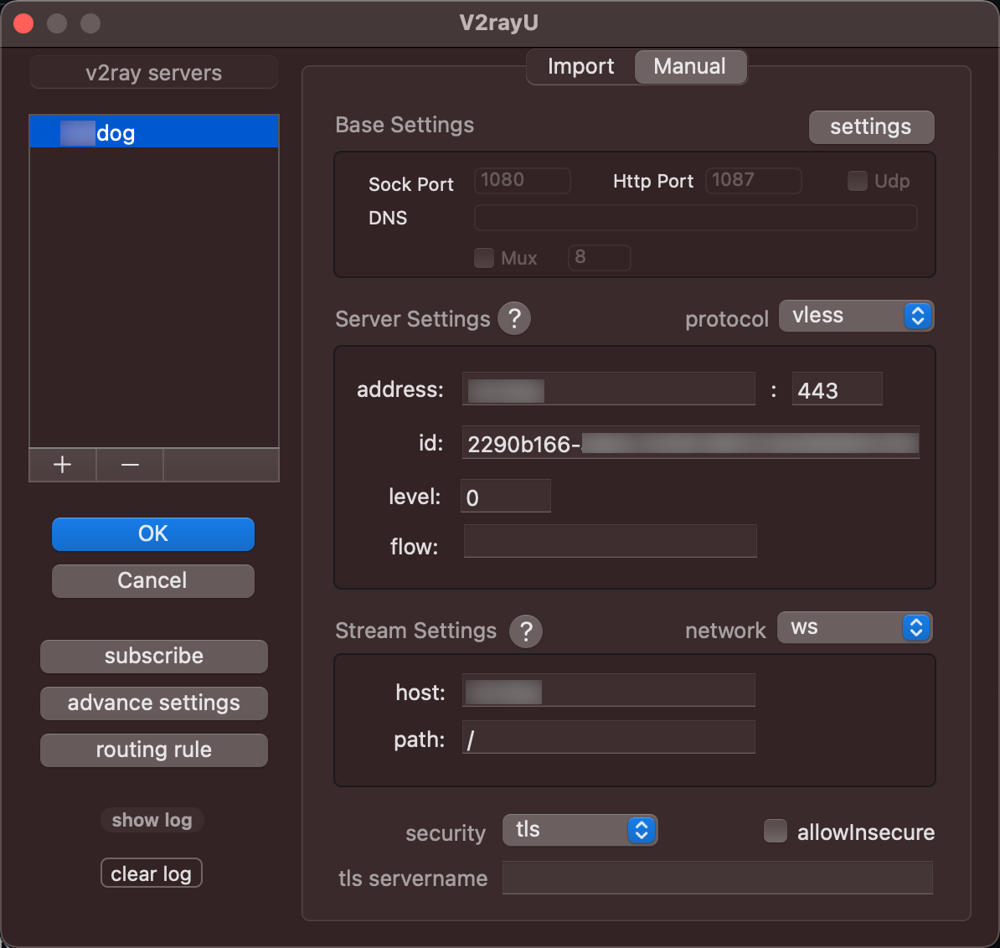

之前搭建的 V2ray+vmess，用了一段时间后，还是被墙了。

Vless是后面推出的V2ray传输协议，在VMess的基础上作了一定的改进和优化，代表着V2ray未来的发展方向。

VLESS+WS+TLS的搭建，涉及到伪装网站以及TLS证书的申请，因此需要提前申请一个域名，指向你的VPS服务器。

## 申请域名并配置解析

参考 [适合小白的V2Ray(VLESS+WebSocket+TLS)一键搭建图文教程](https://www.itblogcn.com/article/2026.html)，可申请免费的 freenom 域名。

申请好域名后，添加一条记录，Type填A、Name填www或@、Target填VPS服务器的IP地址、TTL 默认，点击保存生效。

> A记录就是把一个域名解析到一个IP地址（Address，特制数字IP地址），而CNAME记录就是把域名解析到另外一个域名。

## server安装v2ray

ssh 连接上 VPS 后，在终端输入以下命令回车执行一键安装：

```Shell
bash <(curl -s -L https://raw.githubusercontent.com/xyz690/v2ray/master/onestep.sh)
```

执行脚本后，根据提示，输入域名，示例：

```
先把域名解析到当前服务器IP,然后将域名填到下面，一定一定一定要正确，不！能！出！错！ 退出请安 Ctrl + C
(例如：demo.com或www.demo.com): www.demo.com
```

看到以下配置信息，则表示安装完成。

```
---------- V2Ray 配置信息 -------------

 ---提示..这是 VLESS 服务器配置---
 地址 (Address) = www.demo.com
 端口 (Port) = 443
 用户ID (User ID / UUID) = dd12ab71-9648-409e-a10a-2224e82a6xcd
 流控 (Flow) = 空
 加密 (Encryption) = none
 传输协议 (Network) = ws
 伪装类型 (header type) = none
 伪装域名 (host) = www.demo.com
 路径 (path) = /
 底层传输安全 (TLS) = tls

---------- END -------------
```

执行 `v2ray info` 可查看 V2Ray 配置信息；
执行 `v2ray url` 生成 V2Ray vless URL。

## local配置v2ray

参考 [神一样的工具们](https://www.v2ray.com/awesome/tools.html)，macOS 下载安装 [V2rayU](https://github.com/yanue/V2rayU)。

macOS 安装最新的 V2rayU 3.3.0 客户端后，启动后右上角点开托盘图标，展开下拉菜单。

点击 `Configure`，Import 中直接输入 V2Ray vless URL，切换到 Manual 可以看到自动解析出来的配置。



然后，点击 `Pac Mode` 切换到 PAC 模式。

## v2ray多用户配置

[v2ray多用户配置](https://v2xtls.org/v2ray%E5%A4%9A%E7%94%A8%E6%88%B7%E9%85%8D%E7%BD%AE/)
[V2Ray多用户配置的正确姿势究竟是怎样？](https://github.com/v2ray/v2ray-core/issues/679)

## refs

[V2Ray很难成功访问成功](https://github.com/v2fly/v2ray-core/discussions/1383) - 建议 vless+tls+tcp

[【VPS】V2ray(VLess)+域名+TLS高阶搭建全过程](https://lipeng1667.github.io/2020/12/17/VPS-V2ray-VLess-TLS/)

[V2Ray WS+TLS一键安装脚本wulabing版 自动搭建网站/证书续期/BBR加速](https://ssr.tools/1328)

- [wulabing V2Ray 一键安装脚本](https://www.linuxv2ray.com/oneclick/wulabing-v2ray-one-click-script/)

- [wulabing / Xray_onekey](https://github.com/wulabing/Xray_onekey)

    - 安装/更新方式（Nginx 前置）：VLESS + TCP + TLS + Nginx + WebSocket
    - 安装/更新方式（Xray 前置）：VLESS + TCP + XTLS / TLS + Nginx；VLESS + TCP + XTLS / TLS + Nginx 及 VLESS + TCP + TLS + Nginx + WebSocket 回落并存模式

- [wulabing / V2Ray_ws-tls_bash_onekey](https://github.com/wulabing/V2Ray_ws-tls_bash_onekey)

    - Vmess+websocket+TLS+Nginx+Website
    - VLESS+websocket+TLS+Nginx+Website

[V2ray VLESS一键搭建 VLESS+WS+TLS+WEB一键安装脚本/Debian/Ubuntu/CentOS/支持CDN](https://vpsgongyi.com/p/6037/)
