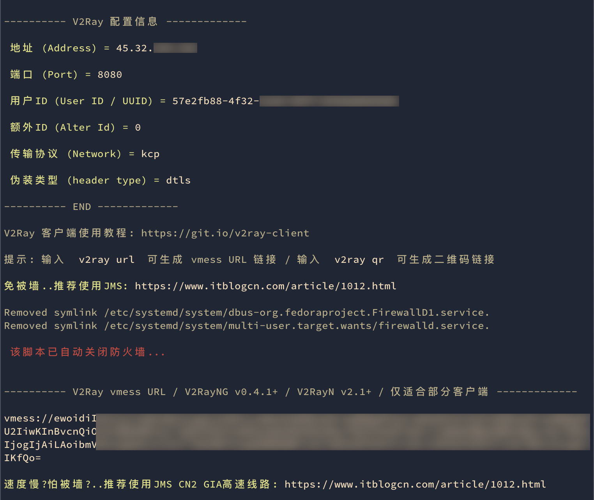

[TOC]

[国外VPN排行榜](https://www.rankss0.com/280.html)

## v2ray

[最新翻墙协议与技术原理](https://www.linuxcross.com/protocols/)

[v2ray](https://www.v2ray.com/) 是近几年兴起的科学上网技术，采用新的协议，因功能强大、能有效抵抗墙的干扰而广受好评。

- [神一样的工具们](https://www.v2ray.com/awesome/tools.html)
- [V2Ray 配置指南](https://toutyrater.github.io/)
- [新 V2Ray 白话文指南](https://guide.v2fly.org/)

v2rayN & V2rayU:

- [v2rayN](https://github.com/2dust/v2rayN): A V2Ray client for Windows, support Xray core and v2fly core
- [V2rayU](https://github.com/yanue/V2rayU) - [docs](https://yanue.github.io/V2rayU/): 基于v2ray核心的mac版客户端,用于科学上网,使用swift编写,支持vmess,shadowsocks,socks5等服务协议,支持订阅, 支持二维码,剪贴板导入,手动配置,二维码分享等。

[科学上网客户端大全](https://v2rayn.org/all-proxy-client/)

- [V2Ray 客户端](https://itlanyan.com/v2ray-clients-download/)
- win 平台客户端: [v2rayN](https://v2rayn.org/), [Clash for Windows](https://clashforwindows.org/)
- mac 平台客户端: [V2rayU](https://v2rayu.org/), ClashX
- iOS 平台客户端: Shadowrocket, Quantumult

## vultr+v2ray

[自建v2ray服务器教程](https://github.com/Alvin9999/new-pac/wiki/%E8%87%AA%E5%BB%BAv2ray%E6%9C%8D%E5%8A%A1%E5%99%A8%E6%95%99%E7%A8%8B)
[2023最新V2Ray搭建图文教程](https://www.itblogcn.com/article/406.html)

### server安装v2ray service

本地通过 ssh 命令连接上远程服务器之后，输入以下命令一键安装V2Ray脚本到 vultr server instance 上。

参考 Project V 官方文档 [下载安装](https://www.v2ray.com/chapter_00/install.html) 中的 [Linux 安装脚本](https://github.com/v2fly/fhs-install-v2ray)，为了方便后续脚本的执行安装，最好切换成 root 账户操作。

```Shell
bash <(curl -L -s https://install.direct/go.sh)
```

这里采用 [xyz690/v2ray](https://github.com/xyz690/v2ray/tree/master) 脚本，安装简单方便，自动关闭防火墙，自动安装BBR加速。

```Shell
bash <(curl -s -L https://raw.githubusercontent.com/xyz690/v2ray/master/go.sh)
```

脚本运行结束后，可以看到 V2Ray 配置信息：



记住这个 V2Ray vmess URL，在 V2RayU 客户端中可基于这个 vmess URL 导入配置。

---

老鸟可以执行以下命令自定义安装：

```Shell
bash <(curl -s -L https://raw.githubusercontent.com/xyz690/v2ray/master/install.sh)
```

可自行阅读安装sh脚本，查看学习关闭防火墙和安装开启BBR的步骤，也可参考 [vultr安装v2ray手记](https://www.daehub.com/archives/8491.html) 和 [V2Ray完全使用教程](https://yearliny.com/v2ray-complete-tutorial/)。

#### v2ray cmds

可以输入 `v2ray -h` 查看帮助，确认是否安装成功。
执行 `which v2ray` 可以查看 bash shell 安装 v2ray 的具体位置。
v2ray 的配置文件路径为 `/etc/v2ray/config.json`。

1. 脚本管理类命令：

    - `v2ray status`: 查看 V2Ray 运行状态
    - `v2ray log`: 查看 V2Ray 运行日志
    - `v2ray update.sh`: 更新 V2Ray 管理脚本
    - `v2ray update`: 更新 V2Ray
    - `v2ray uninstall`: 卸载 V2Ray
    - `v2ray stop`: 停止 V2Ray
    - `v2ray start`: 启动 V2Ray
    - `v2ray restart`: 重启 V2Ray

2. 执行 `v2ray info` 可查看 V2Ray 配置信息，包括：

   - 地址 (Address) = ip.ip.ip.ip
   - 端口 (Port) = 8080
   - 用户ID (User ID / UUID) = uuid
   - 额外ID (Alter Id) = 0
   - 传输协议 (Network) = kcp
   - 伪装类型 (header type) = dtls

3. 配置管理类命令：

    - `v2ray config` 修改 V2Ray 配置
    - `v2ray url`: 生成 V2Ray vmess URL
    - `v2ray qr`: 生成 V2Ray 配置二维码链接，主要供移动端使用

### local安装v2ray client

参考 [神一样的工具们](https://www.v2ray.com/awesome/tools.html)，macOS 下载安装 [V2rayU](https://github.com/yanue/V2rayU)。

macOS 安装最新的 V2rayU 3.3.0 客户端后，启动后右上角点开托盘图标。

1. `Turn v2ray-core Off/On`：开启或停止 core，菜单第一行可以看到状态。
2. `Global Mode`：全局模式，也可以选择 Pac、Manual 模式。
3. `Configure`：Import 中直接输入 V2Ray vmess URL，切换到 Manual 可以看到自动解析出来的配置。
4. `Servers`：如果配置了多个V2Ray链路节点，这里可以快捷切换。

#### DNS 问题

如果访问油管突然报错 “您没有联网，请检查网络连接”，可能是 DNS 解析出了问题。

若在清除网站Cookie、命令行清除DNS缓存后，依然无法ping通youtube.com，请尝试添加以下DNS Servers：

1. 114.114.114.114
2. 8.8.8.8
3. 8.8.4.4

[macOS 使用 VPN 可以访问 Youtube 无法访问 Google 的原因和解决方案](https://gist.github.com/xgqfrms/2947c754b9ffc1f40f7fd6e7bfbca60e)

### routing rule

V2Ray 内建了一个简单的[路由功能](https://www.v2ray.com/chapter_02/03_routing.html)，可以将入站数据按需求由不同的出站连接发出，以达到按需代理的目的。
这一功能的常见用法是分流国内外流量，V2Ray 可以通过内部机制判断不同地区的流量，然后将它们发送到不同的出站代理。

- [V2Ray 配置指南 - 路由功能](https://toutyrater.github.io/basic/routing/)

在 V2rayU Configure 配置界面点击 `routing rule`，默认路由配置如下：

- Domain Strategy: `Asls`
- Routing Rule: `Global`
- rules line: 初始为空

```JSON
  "routing": {
    "settings": {
      "domainStrategy": "AsIs",
      "rules": []
    }
  },
```

outbounds 中至少配置了3条出口规则，tag分别是代理、直连和阻塞。

- "tag": "proxy", "protocol": "vmess",
- "tag": "direct", "protocol": "freedom",
- "tag": "block", "protocol": "blackhole",

在 routing.settings.rules 中按 field 为 domain 和 ip 各配一条 `outboundTag` 为直连（direct）的路由。

- domain 域名为 "localhost"、"geosite:cn"（中国大陆主流网站的域名）
- ip 地址为 "geoip:cn"（中国大陆的IP）、"geoip:private"（私有地址IP，如路由器管理地址等）

访问中国大陆网站的数据包时，domain 和 ip 匹配到路由规则（outboundTag="direct"）时走直连，匹配不到或访问国外网站则默认走 VPS 代理。

```JSON
  "routing": {
    "settings": {
      "domainStrategy": "IPIfNonMatch",
      "rules": [
        {
          "type": "field",
          "outboundTag": "direct",
          "domain": [
            "localhost",
            "geosite:cn"
          ]
        },
        {
          "type": "field",
          "outboundTag": "direct",
          "ip": [
            "geoip:private",
            "geoip:cn"
          ]
        }
      ]
    }
  },
```

### share wlan

[Share your computer network for Switch devices](https://xc.v2ray.cx/knowledgebase/364/Share-your-computer-network-for-Switch-devices.html) - Win **V2rayN**

- [iPhone/iPad通过电脑局域网共享翻墙](https://github.com/bannedbook/fanqiang/blob/master/ios/fqByLan.md)

[手机无客户端在局域网环境实现科学上网](https://www.cfmem.com/2021/08/blog-post.html)

- Windows V2rayN, macOS V2rayU

[v2ray是否可以局域网共享？](https://github.com/v2ray/v2ray-core/issues/210)

1. Configure - advance settings 将 Local Http Listen Host 从默认的 127.0.0.0 修改为局域网IP或0.0.0.0，保存后重启 V2rayU。
2. 手机 - 设置 - 无线局域网，点击📶后面的ℹ️，最底下 HTTP代理-配置代理，手动输入服务器IP（macOS的局域网IP）和端口即可。
